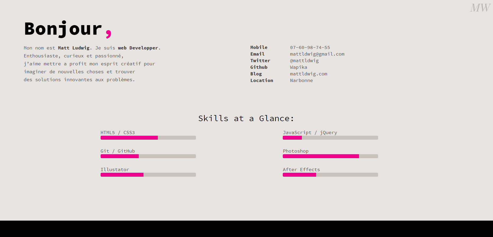

# Udacity FrontEnd Nanodegree - RESUME

This is part of the Udacity's FrontEnd developper Nanodegree. For more informations check out the [project guide](GUIDE.md)

---
## How it works

1. Clone the repo `git clone https://github.com/MattLdwig/FEND-Nanodegree-Resume.git`
2. Navigate to the folder `cd FEND-Nanodegree-Resume`
2. Open `index.html`

